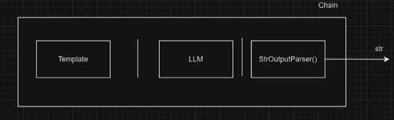

# 0️⃣ LangChain with Ollama Integration

## Overview
This project integrates LangChain with an Ollama-based language model to process and generate text using various prompt templates and chains. It provides functionalities for structured AI-generated responses with different levels of complexity.

## Features
- Uses **LangChain** to structure prompts and interact with the **Ollama** language model.
- Implements **prompt templates** for flexible query generation.
- Supports **sequential chains** to refine responses.
- Allows **text analysis** using chained runnables.

## Requirements
Ensure you have the following dependencies installed:

```bash
pip install langchain ollama python-dotenv
```

Additionally, set up a `.env` file with the necessary API keys if required.

## File Structure

- `1.promp_templates.py`  
  Defines prompt templates for structured AI queries.
- `2.langchain.py`  
  Initializes and invokes the LangChain model with sample queries.
- `3.chains.py`  
  Demonstrates sequential and chained prompt execution.


## Example Output
When running `3.chains.py`, a sample response could be:

```
'The solar system consists of 8 planets. The Sun is at the center. Earth is the third planet. Jupiter is the largest. The solar system is vast.'
```

## Customization
- Modify `model` in each script to switch between different LLaMA models.
- Adjust **temperature** and **num_predict** for varying response styles.
- Extend prompt templates to fit different query scenarios.


# 1️⃣ Prompt template

## Usage

1. Start an Ollama server locally (if applicable).
2. Run any of the Python scripts to test the functionality:
   
   ```bash
   python 1.promp_templates.py
   ```

3. Modify the scripts to customize prompts and chains as needed.


## Implementation
### Langchain Messages

**1. Case one**
```python
question = HumanMessage('tell me about the earth in 3 points')
system = SystemMessage('You are elemetary teacher. You answer in short sentences.')
```
**Output:**
```sh
Here's what I know about the Earth:

1. The Earth is a big ball, and it's round.
2. It's home to all living things, like plants, animals, and people.
3. The Earth has air, water, and land, and we need them to live.
```

 **2. Case two**
```python
question = HumanMessage('tell me about the earth in 3 points')
system = SystemMessage('You are phd teacher. You answer in short sentences.')
```
**Output:**
```sh
Here are three key points about the Earth:
1. **Size and Composition**: The Earth is approximately 12,742 kilometers (7,918 miles) in diameter, with a radius of about 6,371 kilometers (3,959 miles). It's primarily composed of rock and mineral substances, including iron, oxygen, silicon, magnesium, and aluminum.
2. **Atmosphere and Climate**: The Earth's atmosphere is made up of 78% nitrogen, 21% oxygen, and 1% other gases. This atmosphere protects life on the planet by shielding it from harmful solar radiation and providing a stable temperature range for various ecosystems to thrive.
3. **Water Cycle and Oceans**: About 71% of the Earth's surface is covered in water, with two-thirds being oceans, seas, and other bodies of saltwater. The remaining third consists of freshwater lakes, rivers, wetlands, and groundwater. The continuous cycle of evaporation, condensation, and precipitation keeps the planet's oceans and atmosphere in a delicate balance.
```

### Langchain Prompt Templates


**1. Case one**
```python
system = SystemMessagePromptTemplate.from_template('You are {school} teacher. You answer in short sentences.')
question = HumanMessagePromptTemplate.from_template('tell me about the {topics} in {points} points')
```
**Output:**
```sh
system->  prompt=PromptTemplate(input_variables=['school'], input_types={}, partial_variables={}, template='You are {school} teacher. You answer in short sentences.') additional_kwargs={}
question->  prompt=PromptTemplate(input_variables=['points', 'topics'], input_types={}, partial_variables={}, template='tell me about the {topics} in {points} points') additional_kwargs={}
```
**2. Case two**

```python
print(question.format(topics='sun', points=5))
print(system.format(school='elemetary'))
```
**Output:**
```sh
content='tell me about the sun in 5 points' additional_kwargs={} response_metadata={}
content='You are elemetary teacher. You answer in short sentences.' additional_kwargs={} response_metadata={}
```

**2. Case three**

```python
messages = [system, question]
template = ChatPromptTemplate(messages)
question = template.invoke({'school': 'elementary', 'topics': 'sun', 'points': 5})
response = llm.invoke(question)
print(response.content)
```
**Output:**
```sh
Here's what I know about the sun:

• The sun is a massive ball of hot, glowing gas.
• It's the center of our solar system and makes up about 99% of it.
• The sun is so big that it makes all the planets orbit around it.
• The sun gives us light and warmth by heating up its surface.
• Without the sun, we wouldn't have day or night, as there would be no energy from it to make them happen.
```

# 2️⃣ Chains

## Usage

1. Start an Ollama server locally (if applicable).
2. Run any of the Python scripts to test the functionality:
   
   ```bash
   python 2.langchain.py
   ```
3. Modify the scripts to customize prompts and chains as needed.


## Langchain Expression Language Basics
- LangChain Expression Language is that any two runnables can be "chained" together into sequences.
- The output of the previous runnable's .invoke() call is passed as input to the next runnable.
- This can be done using the pipe operator (|), or the more explicit .pipe() method, which does the same thing.
- Type of LCEL Chains
   - SequentialChain
   - Parallel Chain
   - Router Chain
   - Chain Runnables
   - Custom Chain (Runnable Sequence)
## StrOutParser
- `StrOutputParser` is a class in **LangChain**, a Python library used for building AI applications based on language models.
- `StrOutputParser` is responsible for **converting the output of a language model into a plain string (`str`)**. In simple terms, it ensures that the model's response is returned as a clean text output.



# 3️⃣ LangChain

## Overview
This Python script integrates with the **LangChain** framework using **Ollama** to process natural language queries. It initializes a local **Ollama** language model (LLaMA 3.2) and generates responses to user-provided queries.
- https://pytorch.org/get-started/locally/
- Reference to the ChatOllama documentation:
https://python.langchain.com/api_reference/ollama/chat_models/langchain_ollama.chat_models.ChatOllama.html#langchain_ollama.chat_models.ChatOllama

## Requirements
Ensure you have the following dependencies installed before running the script:

- Python 3.x
- `langchain_ollama` (LangChain integration for Ollama models)
- `dotenv` (For loading environment variables)
- An **Ollama** server running locally

## Installation
1. Clone the repository or copy the script to your local machine.
2. Install the required Python packages:
   ```sh
   pip install langchain_ollama python-dotenv
   ```
3. Set up an `.env` file in the same directory (if needed) with the following optional environment variables:
   ```ini
   LANGCHAIN_API_KEY=your_api_key_here
   LANGCHAIN_ENDPOINT=your_endpoint_here
   LANGSMITH_TRACING=false
   ```
4. Ensure the **Ollama** server is running locally at `http://localhost:11434`.

## Usage
Run the script using:
```sh
python 3.langchain.py
```

The script sends the query:
```
"What are the causes and consequences of climate change?"
```
to the language model and prints the response.

## Configuration
The following parameters are defined in the script:
- **Model**: `llama3.2:1b`
- **Temperature**: `0.8` (Controls randomness; higher values generate more creative responses)
- **Response Length**: Limited to `256` tokens

To modify the query, update the `sentence` variable in the script.


### Notes
- Ensure that the **Ollama** server is running before executing the script.
- Modify the base URL, model, and parameters as needed for different configurations.

## Implementation

**1. Initialize the language model (llm):**

- **The ChatOllama class is instantiated with:**
  
```python
# Define the base URL for the local Ollama server
base_url = "http://localhost:11434"
# Specify the language model to use
model = 'llama3.2:1b'

# Initialize the Ollama-based language model (LLM) with specific parameters
llm = ChatOllama(
    base_url=base_url,  # The URL where the Ollama server is running
    model=model,  # The specific LLaMA model being used
    temperature=0.8,  # Controls response randomness (higher value = more creative)
    num_predict=256,  # Limits the response to 256 tokens
    # Additional parameters can be added here...
)
print("llm-> ", llm)
```
**Output:**
```bash 
llm->  model='llama3.2:1b' num_predict=256 temperature=0.8 base_url='http://localhost:11434'
```


**2. Generate a response from the model:**

- A query is assigned to sentence.
- The model is invoked with llm.invoke(sentence), generating a response.
- The response content is printed to the console.
```bash 
# Define the input sentence (query) for the model
sentence = "¿Cuáles son las causas y consecuencias del cambio climático?" 
# Invoke the model with the given sentence and store the response
response = llm.invoke(sentence)
# Print the model's response to the console
print(response.content)
```
## Key Takeaways:
- The script connects to a locally hosted Ollama instance.
- It uses the LLaMA 3.2 (1B) model to process and respond to queries.
- The .env variables are loaded but not actively used in the script.
- The temperature and token limit settings control the model’s response style and length.

