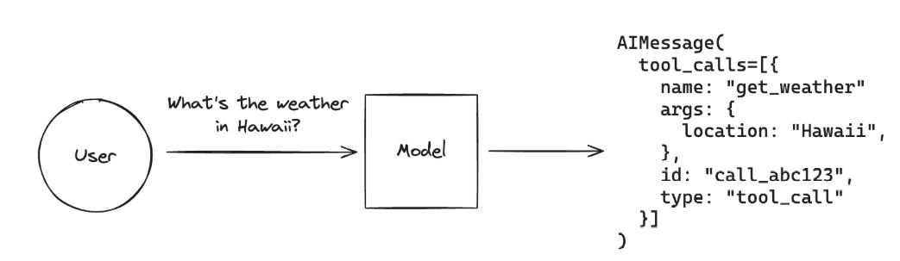
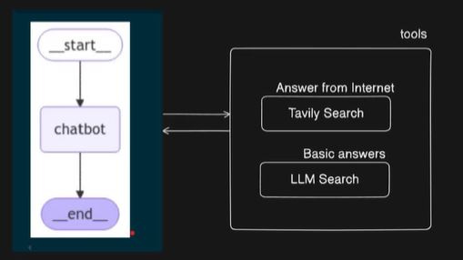
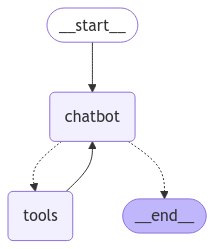

# LangGraph-and-Ollama


## 1️⃣ Tool calling

- LLM Automatically calls the function based on the query
- Function parameters are automatically passed to the function
- It is one of the essential requirements of the Agent
- Not all LLM supports tool calling.



### Custom Tools
### Calling In-Built 
#### DuckDuckGo Search
- https://python.langchain.com/docs/integrations/tools/ 
- DuckDuckGoSearchRun, una herramienta de búsqueda en línea basada en el motor de DuckDuckGo
- search = DuckDuckGoSearchRun()
Crea una instancia de DuckDuckGoSearchRun, que es una clase utilizada en LangChain para ejecutar búsquedas en DuckDuckGo.
Esta clase permite realizar búsquedas en la web sin rastreo, a diferencia de Google.

- search.invoke("What is today's stock market news?")
Ejecuta la búsqueda con la consulta "What is today's stock market news?".
Retorna los resultados de la búsqueda en tiempo real.

#### Tavily Search
#### Wikipedia
#### PubMed
PubMed® comprises more than 35 million citations for biomedical literature from MEDLINE, life science journals, and online books. Citations may include links to full text content from PubMed Central and publisher web sites.
#### Tool Calling with LLM

### Generate Final Result with Tool Calling

```bash 
query = "What is medicine for lung cancer?"
messages = [HumanMessage(query)]
```


```bash 
ai_msg = llm_with_tools.invoke(messages)
messages.append(ai_msg) # Append AI's response to the messages
```


```bash 
for tool_call in ai_msg.tool_calls:
    name = tool_call['name'].lower()  # Get the tool name
    selected_tool = list_of_tools[name]  # Find the tool from the dictionary
    tool_msg = selected_tool.invoke(tool_call)  # Execute the tool
    messages.append(tool_msg)  # Append the tool response
```


```bash 
# Se vuelve a invocar al LLM con la nueva información
response = llm_with_tools.invoke(messages)
print("Response->" ,response.content)
```


## 2️⃣ Chatbot Langraph

This script sets up a chatbot using LangGraph, LangChain, and Ollama (a local LLM). The chatbot is capable of answering user queries either by using an LLM or by searching the web for real-time information.

Generate api key -> https://app.tavily.com/home 




### Imports:
- TavilySearchResults: A tool for web search.
- ToolNode, tools_condition: Used to create and manage tools in LangGraph.
- HumanMessage, tool: Essential for LangChain's tool-based interactions.
- ChatOllama: A local LLM interface.
### Defining the LLM (ChatOllama):

- llm = ChatOllama(model="llama3.2:3b", base_url="http://localhost:11434")
- This initializes the chatbot using the LLaMA 3.2 model running locally.
### Defining Tools:

- internet_search: Uses TavilySearchResults to fetch real-time web data.
- llm_search: Uses the LLM to generate responses from its trained knowledge.
### Binding Tools to LLM:
- The chatbot is configured to use either the LLM or the internet search tool based on the query.
### State and Memory Management:
- State: Stores messages exchanged in the conversation.
- MemorySaver(): Saves conversation history.
### Building the Graph-Based Chatbot:
- Nodes:
"chatbot": Handles conversation flow.
"tools": Executes the selected tool (either LLM or web search).
- Edges:
The chatbot node decides whether to use a tool.
The tool node processes the query and returns results to the chatbot.
### Visualization:


### Running the Chatbot:
- The chatbot operates in a while True loop.
- The user can input queries, and responses are fetched using the graph-based chatbot.
- The program exits when the user types "exit", "quit", or "q".
### Summary
- This chatbot integrates LangGraph for structured interactions.
- It uses LLaMA 3.2 for AI-generated responses and TavilySearchResults for real-time web search.
- The chatbot decides whether to answer from its own knowledge or search the internet.
- It continuously interacts with users until they choose to exit.


### 4️⃣

### 
###
###
###