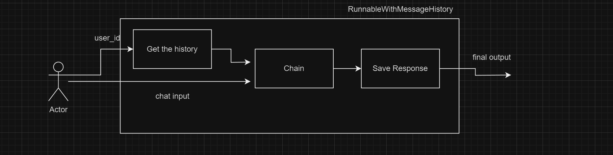
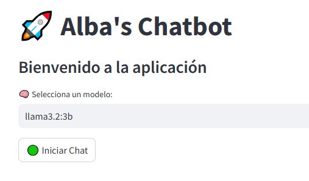
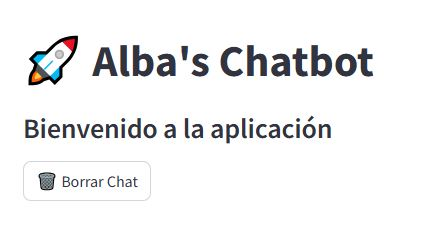
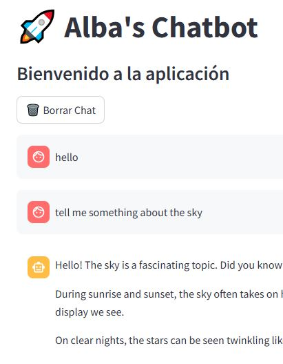

# 1️⃣ Chat message memory

## Overview

- We need to store the historical chat messages in a efficient way
- It wraps another Runnable and manages the chat message history for it.
- Specifically, it loads previous messages in the conversation BEFORE passing it to the Runnable, and it saves the generated response as a message AFTER calling the runnable.
- This class also enables multiple conversations by saving each conversation with a `session_id` it then expects a `session_id` to be passed in the config when calling the runnable, and uses that to look up the relevant conversation history


## Usage

```sh
   python 1.chat_message_memory.py
```

## Implementation

**1. Simple chain**

```python
base_url = "http://localhost:11434"
model = 'llama3.2:3b' # Specify the model to be used (Llama 3.2 with 3 billion parameters)
llm = ChatOllama(base_url=base_url, model=model) # Initialize the ChatOllama model with the base URL and model

template = ChatPromptTemplate.from_template("{prompt}") # Create a chat prompt template that accepts a variable input as "prompt"
chain = template | llm | StrOutputParser() # Create a processing chain: the template is passed to the LLM, and the response is parsed into a string using StrOutputParser

about = "My name is Alba Vadillo. I work for KGP Talkie."
response1=chain.invoke({'prompt': about})
print("response1-> ",response1)
#------------------------
prompt = "What is my name?"
response2=chain.invoke({'prompt': prompt})
print("response2-> ",response2)
```
**Output:**

```sh
   response1->  Hello Alba, it's nice to meet you! Welcome to our conversation. KGP Talkies, that sounds like an interesting company. What does KGP Talkie do, if I might ask?
   response2->  I don't have any information about you, so I don't know your name. We just started our conversation, and I'm here to help answer any questions or provide information on a wide range of topics. How can I assist you today?
```

It looks like the model isn't retaining context between responses. This is likely because:

- Stateless Execution: Each invocation of `chain.invoke()` is independent, meaning the model doesn't remember previous inputs.
- Lack of Memory Component: LangChain allows memory modules to maintain conversational context, but your setup doesn't include one.

**2. Runable with history**

In order to properly set this up there are two main things to consider:
- How to store and load messages?
- What is the underlying Runnable you are wrapping and what are its inputs/outputs?

- This script stores and retrieves conversation history using SQLite.
- The function `get_session_history(session_id)` ensures each user has a separate conversation history.
- `RunnableWithMessageHistory` wraps the main processing chain (`chain`) to maintain memory.
- By using the same `session_id` (`user_id`), the model should remember previous interactions.
- The `invoke()` calls simulate a conversation where the model should recall the user’s name from history.

**3. Message History with Dictionary Like Inputs**


# 2️⃣ Alba's Chatbot

## Description
Alba's Chatbot is a simple chatbot application built using Streamlit. It integrates with an LLM (Large Language Model) to provide interactive conversations. The chatbot keeps track of conversation history and allows users to start new conversations.

## Features
- Interactive chat interface using Streamlit.
- Session-based chat history storage.
- Integration with an LLM (Llama 3.2:3b model).
- Ability to start new conversations and clear chat history.
- Real-time response streaming.

## Installation
### Prerequisites
Make sure you have Python installed and the required dependencies.

### Steps
1. Clone the repository or download the script.
```bash
    git clone <repository-url>
    cd chatbot_project
```
2. Install the required dependencies.
```bash
    pip install -r requirements.txt
```
3. Run the chatbot.
```bash
    streamlit run 2.chatbot.py
```

## Usage
- Open the chatbot in your web browser.
- Type messages in the input field and receive responses from the chatbot.
- Click on "Start New Conversation" to reset the chat history.

## Configuration
- The chatbot uses a local API endpoint (`http://localhost:11434`). Update the `base_url` variable in `2.chatbot.py` if needed.
- Modify the model in the `model` variable (`llama3.2:3b`) to use a different LLM model.

## Dependencies
- Python
- Streamlit
- SQLAlchemy
- ChatOllama (for handling chatbot responses)

## Implementation

**1. Streamlit UI Setup**
- This sets up the chatbot UI with a title `"Albas's Chatbot"` and a welcome message `"WE CAN START NOW"` using `Streamlit`.
```python
st.title("Albas's Chatbot")
st.write("WE CAN START NOW")
```
**2. Define the constants**
```python
base_url = "http://localhost:11434"
model = 'llama3.2:3b'
user_id="Alba Vadillo"
```
**3. Sesion History Function**
- This function fetches the chat history from an SQLite database based on the `session_id`.
```python
def get_session_history(session_id):
    return SQLChatMessageHistory(session_id, "sqlite:///chat_history.db")
```
**4. Initialize Chat History**
- If the chat history doesn’t already exist in `st.session_state` (a Streamlit session variable), it initializes it as an empty list.
```python
if "chat_history" not in st.session_state:
    st.session_state.chat_history = []
```
**5. Start a New Conversation**
- When the "Start New Conversation" button is pressed:
   - The chat history is cleared in `st.session_state`.
   - The function `get_session_history(user_id)` fetches the chat history for the user.
   - `history.clear()` erases previous messages from the database.
```python
if st.button("Start New Conversation"):
    st.session_state.chat_history = []
    history = get_session_history(user_id)
    history.clear()
```
**6. Display Chat History**
-  Iterates through the chat history and displays each message using st.chat_message().
-  `message['role']`: Either `'user'` or `'assistant'`.
-  `message['content']`: The actual message text.
```python
for message in st.session_state.chat_history:
    with st.chat_message(message['role']):
        st.markdown(message['content'])
```
**7. Set Up Language Model (LLM)**
```python
llm = ChatOllama(base_url=base_url, model=model)
```
- `ChatOllama` is initialized with the base_url and the model name.
```python
system = SystemMessagePromptTemplate.from_template("You are a helpful assistant.")
human = HumanMessagePromptTemplate.from_template("{input}")
messages = [system, MessagesPlaceholder(variable_name='history'), human]
prompt = ChatPromptTemplate(messages=messages)
```

```python
chain = prompt | llm | StrOutputParser()
runnable_with_history = RunnableWithMessageHistory(chain, get_session_history, 
                                                   input_messages_key='input', 
                                                   history_messages_key='history')
```
**8. Function to Chat with LLM**
- Streams responses from `runnable_with_history`.
- Uses `yield output` to return responses as they are generated.

```python
def chat_with_llm(session_id, input):
    for output in runnable_with_history.stream({'input': input}, config={'configurable': {'session_id': session_id}}):
        yield output
```
**9. Handling User Input**
- Displays an input field for the user to enter a message.
```python
prompt = st.chat_input("What is up?")
```
**10. Processing the User's Message**
- If the user enters a message, it is added to the session history.
```python
if prompt:
    st.session_state.chat_history.append({'role': 'user', 'content': prompt})
```
- Displays the user’s message.
```python
with st.chat_message("user"):
    st.markdown(prompt)
```
- Calls chat_with_llm() to generate the chatbot's response and streams it.
```python
with st.chat_message("assistant"):
    response = st.write_stream(chat_with_llm(user_id, prompt))
```
- Saves the chatbot’s response in the session history.
```python
st.session_state.chat_history.append({'role': 'assistant', 'content': response})
```


# 3️⃣ Chatbot basic

# README: Implementing Alba's Chatbot in Streamlit

## Overview
This project is a chatbot implemented using Streamlit and the Ollama API. The chatbot allows users to select different AI models, send messages, and receive responses via streaming.

## Prerequisites
Before running the chatbot, ensure you have the following installed:
- Python 3.8+
- `streamlit` for UI rendering
- `ollama` for AI responses
- Required dependencies (listed in `requirements.txt` if available)

## Installation
1. Clone the repository or copy the script.
2. Install the required dependencies:
   ```bash
   pip install streamlit ollama
   ```
3. Ensure you have access to the Ollama models.

## Running the Chatbot
Run the following command in the terminal:
```bash
streamlit run 3.chatbot_basic.py
```

## Features
- **Model Selection**: Choose from models like `llama3.2:3b`, `mistral`, `gemma:2b`, `codellama`, and `phi3`.
- **Chat Session Management**:
  - Start a conversation.
  - Clear chat history.
  - Maintain conversation state.
- **Streaming Responses**: Messages are displayed in real-time as they are generated.

## Code Breakdown
### 1. Page Configuration
```python
st.set_page_config(page_title="Mi Template en Streamlit", layout="wide")
st.title("🚀 Alba's Chatbot")
st.subheader("Bienvenido a la aplicación")
```
Sets up the Streamlit page layout and title.

### 2. Model Selection
```python
available_models = ["llama3.2:3b", "mistral", "gemma:2b", "codellama", "phi3"]
if "selected_model" not in st.session_state:
    st.session_state["selected_model"] = available_models[0]
```
Initializes available models and sets a default selection.

### 3. Chat Activation and Reset
```python
if not st.session_state["chat_active"]:
    if st.button("🟢 Iniciar Chat"):
        st.session_state["chat_active"] = True
        st.rerun()
```
Handles chat session activation.

```python
if st.session_state["chat_active"]:
    if st.button("🗑️ Borrar Chat"):
        st.session_state["messages"] = []
        st.session_state["chat_active"] = False
        st.success("✅ Chat borrado correctamente.")
        st.rerun()
```
Allows clearing the chat history.

### 4. Streaming Response Handling
```python
def stream_ollama_response(messages, model):
    try:
        response_stream = ollama.chat(model=model, messages=messages, stream=True)
        for chunk in response_stream:
            yield chunk["message"]["content"]
    except Exception as e:
        st.error(f"❌ Error al generar respuesta: {str(e)}")
```
Handles API calls and streaming responses.

### 5. Chat Display & Interaction
```python
prompt = st.chat_input("Enter your question")
if prompt:
    st.session_state["messages"].append({"role": "user", "content": prompt})
    
    with st.chat_message("user"):
        st.markdown(prompt)
```
Captures and displays user input.

```python
with st.chat_message("assistant"):
    response_container = st.empty()
    full_response = ""
    for chunk in stream_ollama_response(st.session_state["messages"], selected_model):
        full_response += chunk
        response_container.markdown(full_response)
```
Handles assistant response streaming and updates the UI.

## Conclusion
This chatbot provides a simple yet powerful interface for interacting with AI models. It maintains chat history, supports multiple models, and delivers real-time responses.









