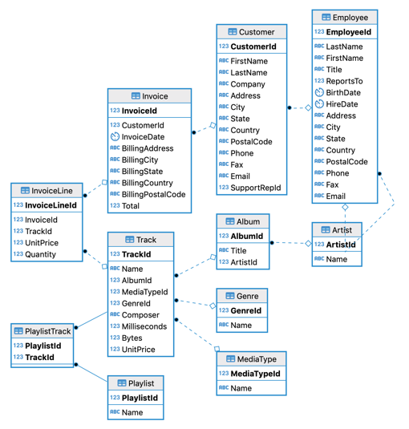
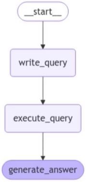
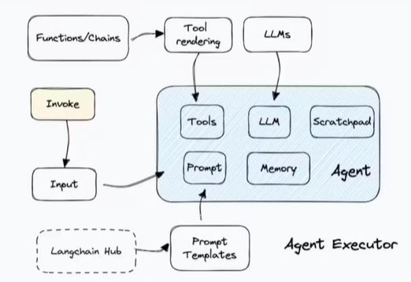

# General: Text to MySQL query chatbot

## Description
This project is an AI-powered MySQL query agent that allows users to interact with a database using natural language queries. It leverages LangChain, Ollama, and LangGraph to generate, execute, and interpret SQL queries from user input. The project utilizes the Chinook database, a sample SQLite database for practicing SQL operations.


 **1. Chinook database**

 - Database -> [Chinook Sample Data - Yugabyte Docs](https://docs.yugabyte.com/preview/sample-data/chinook/)

- Representation

 

 **2. Ollama model** 
- Information
 [Qwen2.5 Model - Ollama Library](https://ollama.com/library/qwen2.5)

```sh
ollama pull qwen2.5 
```

**3. Smith Langchain**

- [LangChain Hub - Smith](https://smith.langchain.com/hub?organizationId=5efcb3f2-4211-5c65-9df5-a364130)

- [Smith LangChain](https://smith.langchain.com/hub/langchain-ai/sql-query-system-prompt?organizationId=5efcb3f2-4211-5c65-9df5-a3641303ab89)


**4. Chat prompt template**
- [SQL Query System Prompt - LangChain Hub](https://smith.langchain.com/hub/langchain-ai/sql-query-system-prompt?organizationId=5efcb3f2-4211-5c65-9df5-a3641303ab89)

```python
query_prompt_template = hub.pull("langchain-ai/sql-query-system-prompt")
#print("query prompt template-> ",query_prompt_template)
query_prompt_template.messages[0].pretty_print()
```
**Output:**

```sh
================================ System Message ================================

Given an input question, create a syntactically correct {dialect} query to run to help find the answer. Unless the user specifies in his question a specific number of examples they wish to obtain, always limit your query to at most {top_k} results. You can order the results by a relevant column to return the most interesting examples 
in the database.

Never query for all the columns from a specific table, only ask for a the few relevant columns given the question.

Pay attention to use only the column names that you can see in the schema description. Be careful to not query for columns that do not exist. Also, pay attention to which column is in which table.

Only use the following tables:
{table_info}

Question: {input}
```
- [smith.langchain.com](https://smith.langchain.com/hub/langchain-ai/sql-agent-system-prompt?organizationId=5efcb3f2-4211-5c65-9d5f-a3641303ab89)

```python
prompt = hub.pull("langchain-ai/sql-agent-system-prompt")
#print("query prompt template-> ",prompt)
prompt.messages[0].pretty_print()
```
**Output:**

```sh
================================ System Message ================================

You are an agent designed to interact with a SQL database.
Given an input question, create a syntactically correct {dialect} query to run, then look at the results of the query and return the answer.
.......
To start you should ALWAYS look at the tables in the database to see what you can query.
Do NOT skip this step.
Then you should query the schema of the most relevant tables.
```

**5. Aplication State or Graph State**

```python
query_prompt_template = hub.pull("langchain-ai/sql-query-system-prompt")
print("query prompt template-> ",query_prompt_template)
query_prompt_template.messages[0].pretty_print()
```

## Features
- **Natural Language to SQL:** Converts user questions into SQL queries using an LLM.
- **Database Interaction:** Executes SQL queries on the Chinook database.
- **Intelligent Response Generation:** Uses AI to interpret and provide human-readable answers.
- **Graph-Based Execution Flow:** Uses LangGraph to structure the process.
- **Error Recovery:** Handles query failures and regenerates them.


## Requirements
```sh
Python 3.8+
pip install -r requirements.txt
Ollama LLM server running locally (http://localhost:11434)
Internet access to download the Chinook database
```

## Installation
```sh
git clone https://github.com/your-repo/text-to-mysql-agent.git
cd text-to-mysql-agent
pip install -r requirements.txt
cp .env.example .env
# Update .env with necessary credentials
python Text_to_MySQL_Agent.py
```

## Architecture
1. **Query Generation:** The LLM generates a valid SQL query.
2. **Execution:** The SQL query runs on the database.
3. **Answer Generation:** The AI interprets the results and responds in natural language.

## Dependencies
```sh
LangChain
Ollama
LangGraph
SQLAlchemy
Requests
```

# 1️⃣MySQL query bot

## Overview

This project is a MySQL Query Bot that automatically generates, executes, and processes database queries based on user input. It uses utility functions to generate SQL queries, execute them on a database, and format responses into readable answers.

## Usage
1. Modify the `user_question` variable in `mysql_query_bot.py` to reflect your query.
2. Run the script with the following command:

```sh
   python mysql_query_bot.py
```


## Implementation
**1. Write the query**
```python
question = "How many employees are there?"
query = write_query({"question": question})
print(query)
```
Ouput:

```sh
{'query': 'SELECT COUNT(*) AS NumberOfEmployees FROM Employee;'}
```
**2. Execute the query**
``` python
result = execute_query(query)
print(result)
```
Ouput:
```sh
{'result': '[(8,)]'}
```

**3. Combine all information into a state dictionary**
``` python
state_dict= {"question": question, **query, **result}
print("state ->",state_dict)
```
Ouput:
```sh
{'question': 'how many employees are there?', 'query': 'SELECT COUNT(*) FROM Employee', 'result': '[(8,)]'}
```

**4. Generate the query**
``` python
state = {"question": question, **query, **result}
answer = generate_answer(state)
print(answer)
```
**Ouput:**
```sh
{'answer': 'Based on the provided SQL query and result, there are 8 employees in total.'}
```

# 2️⃣ Building the graph

## Overview

This project constructs a processing graph to handle query execution using `langgraph`. It defines a sequence of steps to:
1. Write a query.
2. Execute the query.
3. Generate an answer from the results.



## Files

- `building_graph.py`: Main script to build and execute the graph.
- `query_utils.py`: Contains helper functions for query handling.
- `config.py`: Defines the State used in the graph.

## Usage

```sh
   python building_graph.py
```


## Implementation
**1. Build the processing graph**
```python
graph_builder = StateGraph(State)
graph_builder.add_node("write_query", write_query)
graph_builder.add_node("execute_query", execute_query)
graph_builder.add_node("generate_answer", generate_answer)
```

**2. Define the execution flow of the graph**
```python
graph_builder.add_edge(START, "write_query")
graph_builder.add_edge("write_query", "execute_query")
graph_builder.add_edge("execute_query", "generate_answer")
```
**3. Compile and visualize the graph**
```python
graph = graph_builder.compile()
```
**4. Graph schema**

START → Write SQL Query → Execute SQL Query → Generate Answer → END

**5. Example: Query to list all albums**
``` python
query = {'question': 'List all the albums'}
for step in graph.stream(query, stream_mode="updates"):
    print(step)
```
**Output**

```json
{
    "write_query": {
        "query": "SELECT * FROM Album"
    },
    "execute_query": {
        "result": [
            [1, "For Those About To Rock We Salute You", 1],
            [2, "Balls to the Wall", 2],
            [3, "Restless and Wild", 2],
            [4, "Let There Be Rock", 1],
            [5, "Big Ones", 3],
            [6, "Jagged Little Pill", 4],
            [7, "Facelift", 5],
            [8, "Warner 25 Anos", 6],
            [9, "Plays Metallica By Four Cellos", 7],
            [10, "Audioslave", 8]
        ]
    },
    "generate_answer": {
        "answer": "It seems like you've provided a list of tracks or songs with their respective numbers and details. Would you like me to do something specific with this information, such as organize it in a certain way, find patterns, or answer a particular question about it?"
    }
}
```

# 3️⃣ LangGraph AGENTS: Automating query execution with AI

## Overview

This project uses LangGraph and LangChain to build an AI-powered agent capable of querying an SQL database intelligently. The agent can:
- Perform iterative database queries to refine results.
- Detect and recover from query errors.
- Answer questions based on the database structure and content.

- **Agents can:**
  - Query the database multiple times to refine their answer.
  - Recover from errors by detecting failed queries and regenerating them.
  - Answer questions based on both schema structure and database content.
  - They can query the database as many times as needed to answer the user question.
  - They can recover from errors by running a generated query, catching the traceback and regenerating it correctly.
  - They can answer questions based on the databases' schema as well as on the databases' content (like describing a specific table).

- **Flow representation**



## Files

- `langraph_agent.py`: The main script that sets up and executes the AI agent.
- `config.py`: Defines database and prompt configurations.
- `query_utils.py`: Contains helper functions for query handling.

## Usage

```sh
   python langraph_agent.py
```

## Implementation

### **1. System promp**
``` python
system_prompt = prompt.invoke({'dialect': db.dialect, 'top_k': 5})
print("system_prompt-> ",system_prompt)
```

```json
{
  "messages": [
    {
      "type": "SystemMessage",
      "content": "You are an agent designed to interact with a SQL database.\nGiven an input question, create a syntactically correct fies a specific number of  ......  database.\n\nTo start you should ALWAYS look at the tables in the database to see what you can query.\nDo NOT skip this step.\nThen you should query the schema of the most relevant tables.",
      "additional_kwargs": {},
      "response_metadata": {}
    }
  ]
}
```
### **2. Retrieve Available Tools**
``` python
toolkit = SQLDatabaseToolkit(db=db, llm=llm)
print("toolkit context-> ",toolkit.get_context())
```

**Ouput:**
```sh
{
    "table_info": "..."
    "table_names": "..."
}
```

- Key Descriptions:
  - table_info: Contains a large text block with SQL statements to create the database tables, including relationships 
  - table_names: A string listing all table names in the database, separated by commas.

- Content of table_info
  - Includes the structure of several tables such as Album, Artist, Customer, Employee, Genre, Invoice, InvoiceLine, MediaType, Playlist, PlaylistTrack, and Track.
  - Contains CREATE TABLE statements detailing columns, data types, and primary/foreign keys.

``` python
tools = toolkit.get_tools()
print("tools-> ",tools)
```

**Ouput:**
```sh
tools_dict = [
    { "name": "QuerySQLDatabaseTool",},
    { "name": "InfoSQLDatabaseTool", },
    { "name": "ListSQLDatabaseTool", },
    { "name": "QuerySQLCheckerTool",
        "description":
        "db": "<SQLDatabase object at 0x000001FAFFEACEF0>",
        "llm": {
            "model": "qwen2.5",
            "base_url": "http://localhost:11434"
        },
        "llm_chain": {
            "verbose": False,
            "prompt": {
                "input_variables": ["dialect", "query"],
                "template": (
                    "\n{query}\nDouble check the {dialect} query above for common mistakes, including:\n"
                    ....
                    "Output the final SQL query only.\n\nSQL Query: "
                )
            },
        }
    }
]

```
- **QuerySQLDatabaseTool** – Executes SQL queries and handles errors. If a query fails, it suggests corrections.
- **InfoSQLDatabaseTool** – Retrieves table schemas and sample data. Ensures tables exist before querying.
- **ListSQLDatabaseTool** – Lists all available tables in the database.
- **QuerySQLCheckerTool** – Validates SQL queries using an LLM (qwen2.5). Detects and fixes common mistakes before execution.

### **3. Execute an SQL Query**
``` python
# Invoke the first tool to execute an SQL query selecting two rows from the "Album" table
tools[0].invoke("select * from Album LIMIT 2")
# The following line is commented out; it seems to be invoking another tool with table names
# print(tools[1].invoke("Album,Customer"))
```
**Ouput:**
```sh
[(1, 'For Those About To Rock We Salute You', 1), (2, 'Balls to the Wall', 2)]
```

### **4. Create the ReAct Agent**
- The ReAct agent (Reasoning + Acting agent) is created using:
  - llm: A large language model (e.g., GPT).
  - tools: The available tools (including the SQL executor).
  - system_prompt: A predefined prompt that guides the agent’s behavior.
- This agent is designed to reason about a query and take the appropriate action.

``` python
agent_executor = create_react_agent(llm, tools, state_modifier=system_prompt)
save_and_open_graph(agent_executor, filename="assets/agent_graph.png") # Save and open the graph image
```


### **5. Define and Process a User Query**
``` python
# Stream the agent's responses step by step while processing the query
for step in agent_executor.stream(query, stream_mode="updates"):
    print(step)  # Print each step of the execution
    #prints the last message in the response
    step['messages'][-1].pretty_print()
```
**Ouput:**

**1. Agent ('agent') – The LLM (AI model) generates or processes a query.**

- Mensaje del agente: 
    - AIMessage: Representa un mensaje del asistente AI.
        - content: Es el contenido del mensaje (en este caso está vacío, '').
        - response_metadata: Contiene información sobre la ejecución del modelo 
        - tool_calls: Indica si el agente ha llamado a una herramienta para realizar una acción.

**2. Tool ('tools') – The tool responds with results.**
- Mensaje de herramienta: Album, Artist, Customer, Employee, Genre, Invoice, InvoiceLine, MediaType, Playlist, PlaylistTrack, Track

```sh
{
    "tools": {
        "messages": [
            ToolMessage(
                content="Album, Artist, Customer, Invoice...",  # Tool output
                name="sql_db_list_tables",  # Tool used
            )
        ]
    }
}

```

**3. Agent Requests More Details – Queries schema of specific tables.**
- Mensaje del agente: 
    - AIMessage: Representa un mensaje del asistente AI.
        - tool_calls: Indica si el agente ha llamado a una herramienta para realizar una acción.


**4. Tool Responds with Schema Details.**
```sh
{
    "tools": {
        "messages": [
            ToolMessage(
                content="CREATE TABLE 'Customer' (\n 'CustomerId' INTEGER NOT NULL...",
                name="sql_db_schema",
            )
        ]
    }
}
```

**5. Agent Checks Query Validity.**
- Mensaje del agente: 
```sh
{
    "agent": {
        "messages": [
            AIMessage(
                tool_calls=[
                    {
                        "name": "sql_db_query_checker",
                        "args": {
                            "query": "SELECT C.Country, COUNT(I.InvoiceId) AS PurchaseCount FROM Customer C INNER JOIN Invoice I ON C.CustomerId = I.CustomerId GROUP BY C.Country ORDER BY PurchaseCount DESC LIMIT 5"
                        },
                        "id": "478e4a57-016d-4b2f-b5bc-d861398e0f85",
                        "type": "tool_call"
                    }
                ]
            )
        ]
    }
}
```

**6. Tool Confirms Query is Correct.**

- Mensaje de herramienta: The provided SQL query does not contain any common mistakes based on the conditions you've listed. Here is the original query:

```sql
SELECT C.Country, COUNT(I.InvoiceId) AS PurchaseCount
FROM Customer C
JOIN Invoice I ON C.CustomerId = I.CustomerId
GROUP BY C.Country
ORDER BY PurchaseCount DESC
LIMIT 5;
```
```sh
{
    "tools": {
        "messages": [
            ToolMessage(
                content="The provided SQL query does not contain any common mistakes...",
                name="sql_db_query_checker",
                id="1e3bbfb-4b02-4398-a8ed-fc972ae3e609"
            )
        ]
    }
}
```

**7. tool.**
- Mensaje de herramienta: [('USA', 91), ('Canada', 56), ('France', 35), ('Brazil', 35), ('Germany', 28)]
**8. Agent Generates Final Answer.**
- Mensaje del agente: The country with the most purchases is USA, followed by Canada, France, Brazil, and Germany. Here are the top 5 countries based on the number of purchases:
```sh
{
    "agent": {
        "messages": [
            AIMessage(
                content="The country with the most purchases is USA, followed by Canada, France, Brazil, and Germany. Here are the top 5 countries based on purchase count:\n\n1. USA - 91 purchases\n2. Canada - 56 purchases\n3. France - 35 purchases\n4. Brazil - 35 purchases\n5. Germany - 28 purchases"
            )
        ]
    }
}

```