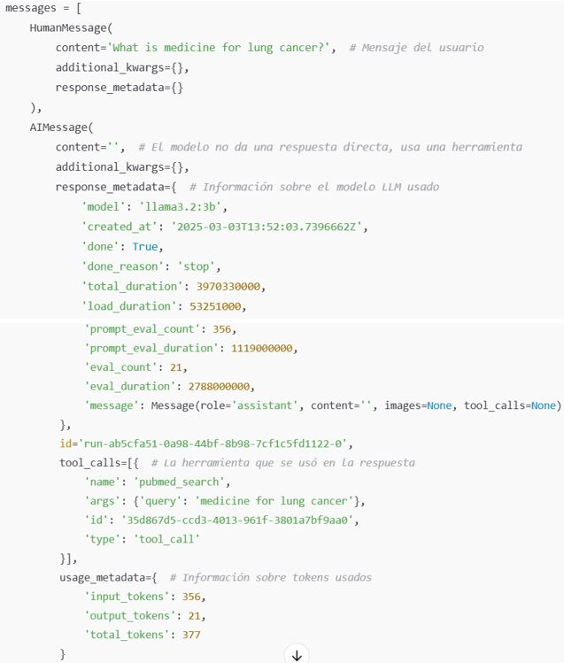
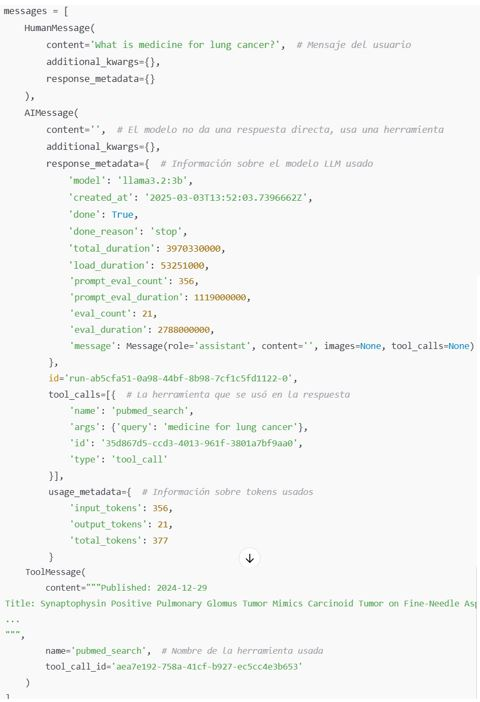
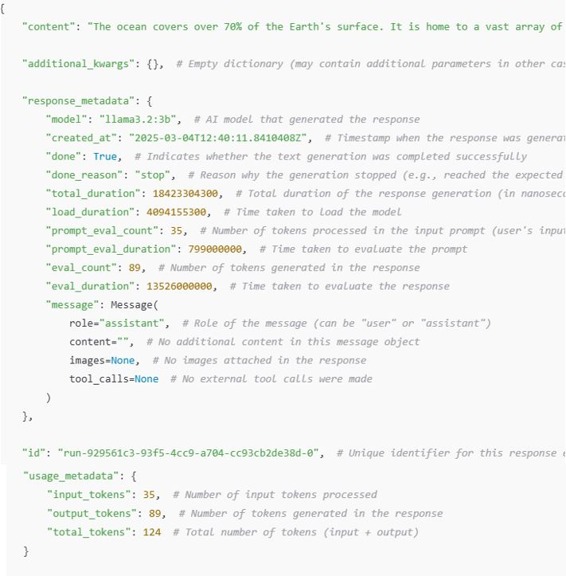
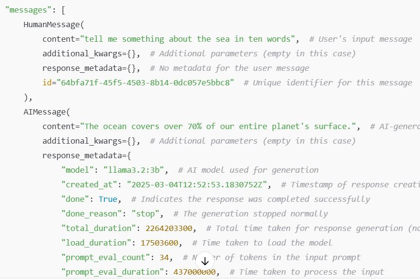

# 1️⃣ Tool calling

## Overview

This script demonstrates how to integrate an LLM (Large Language Model) with various tools to process and respond to queries. The model is configured using ChatOllama and can dynamically invoke functions such as arithmetic operations and web searches.
- https://python.langchain.com/docs/integrations/tools/

- LLM Automatically calls the function based on the query
- Function parameters are automatically passed to the function
- It is one of the essential requirements of the Agent
- Not all LLM supports tool calling.


## Key Features
**1. Tool Creation and Invocation**
- Functions (add, multiply, etc.) are defined and bound to the LLM, allowing it to automatically call them when needed.
- The model can interpret user queries and decide whether a tool should be used for calculations or searches.
- https://python.langchain.com/docs/integrations/tools/ 


**2. Built-in Search Integration**
- Includes search tools like Wikipedia, PubMed, and Tavily for retrieving information.
- **DuckDuckDuck**
   - DuckDuckGoSearchRun, una herramienta de búsqueda en línea basada en el motor de DuckDuckGo
   - Crea una instancia de DuckDuckGoSearchRun, que es una clase utilizada en LangChain para ejecutar búsquedas en DuckDuckGo.
   - Esta clase permite realizar búsquedas en la web sin rastreo, a diferencia de Google.

```python
search = DuckDuckGoSearchRun()
search.invoke("What is today's stock market news?")
```
- Search
   - Ejecuta la búsqueda con la consulta "What is today's stock market news?".
   - Retorna los resultados de la búsqueda en tiempo real.

**3. Handling Tool Calls**
- Queries are processed by checking if a tool needs to be invoked.
- The script extracts the required tool's name, executes it, and appends the results to the conversation.
- The LLM is reinvoked with the updated context to generate a final response.

## Implementation
**1. Define and register tools.**
```python
tools = [wikipedia_search, pubmed_search, tavily_search, multiply2]
list_of_tools = {tool.name: tool for tool in tools}
```
**2. Bind tools to the LLM.**
- `bind_tools(tools)` links the model (llm) with the available tools (e.g., Wikipedia search, PubMed search, Tavily search, or a multiplication function).
- Now, the LLM can automatically decide whether a tool should be used to answer a query.

```python
llm_with_tools = llm.bind_tools(tools)
```
**3. Define the message**

```python 
query = "What is medicine for lung cancer?"
messages = [HumanMessage(query)]
```
**Output:**


**4.  Process user queries:**
- Determine if a tool is required.
- Invoke the appropriate tool.

```python 
ai_msg = llm_with_tools.invoke(messages)
messages.append(ai_msg) # Append AI's response to the messages
```


**5. Generate tool message**

```python 
for tool_call in ai_msg.tool_calls:
    name = tool_call['name'].lower()  # Get the tool name
    selected_tool = list_of_tools[name]  # Find the tool from the dictionary
    tool_msg = selected_tool.invoke(tool_call)  # Execute the tool
    messages.append(tool_msg)  # Append the tool response
```



**6. Reinvoke the LLM with the enriched conversation.**

```python 
response = llm_with_tools.invoke(messages)
print("Response->" ,response.content)
```
**Ouput:**


# 2️⃣ LanGraph 🦜🕸️ 
 
## Overview
This repository contains a Python script that implements a chatbot using **LangChain**, **LangGraph**, and the **Ollama (llama3.2:3b)** model.  
The chatbot manages conversations using a state graph and allows continuous interaction with the user.

## Requirements

Before running the script, make sure you have the following dependencies installed:

```bash
pip install langchain langgraph python-dotenv
```

Also, the **Ollama** server must be running at `http://localhost:11434`.

## 🚀 Execution

1. **Configure environment variables**: The script loads variables from a `.env` file. Set the following variables if needed:
   ```env
   LANGCHAIN_API_KEY=your_api_key
   LANGCHAIN_ENDPOINT=your_endpoint
   LANGSMITH_TRACING=false
   ```

2. **Run the script**:
   ```bash
   python 4.langraph.py
   ```

3. **Interact with the chatbot**:  
   - Type a message to get a response from the bot.  
   - To exit, enter `q`, `quit`, or `exit`.  

## Implementation

**1. Loads environment variables**.  
**2. Initializes the language model** `llama3.2:3b`.  
 ```bash
llm = ChatOllama(model="llama3.2:3b", base_url="http://localhost:11434")
response = llm.invoke("tell me something about the sea in 5 lines")
   ```
**Output**


**Response content:**
 ```bash
response->  The sea is a vast and mysterious body of saltwater that covers over 70% of the Earth's surface. It plays a crucial role in regulating the planet's climate and weather patterns. The sea also supports an incredible array of marine life, from tiny plankton to massive blue whales. Its depth ranges from just a few meters to over 11,000 meters in the Mariana Trench. The sea has been a source of inspiration for humans throughout history, influencing art, literature, and mythology.
```

**3. Defines the chatbot state using `TypedDict`.** 
- `State` is a `TypedDict` that defines a chatbot's state. 
-  `messages` is a list processed using add_messages
-  `Annotated[list, add_messages]` is a hint that messages should be modified by add_messages.

 ```python
class State(TypedDict):
    #{"message":"your message"}
    messages: Annotated[list, add_messages]
def chatbot(state: State):
    response = llm.invoke(state["messages"])  # Invoke the LLM with the current messages
    return {"messages": [response]}  # Return the response as part of the state
```
**4. Creates a state graph** with `LangGraph`:  
- The chatbot processes messages and maintains conversation history.  
- Responses are generated using `ChatOllama`.  
   
 ```python
graph_builder = StateGraph(State)
# Add a chatbot node to handle messages
graph_builder.add_node("chatbot", chatbot)
# Define edges (transitions) between different states # START --> chatbot --> END
graph_builder.add_edge(START, "chatbot")  # Start the conversation with the chatbot
graph_builder.add_edge("chatbot", END)  # End conversation after the chatbot responds
graph = graph_builder.compile() # Compile the graph
```


**5. Visualizes the chatbot flow**   


**6. Invoke**
 ```python
response=graph.invoke({"messages": ["tell me something about the sea in ten words"]})
```

**7. Runs a continuous chat loop** until the user decides to exit.  
```bash
while True:
    user_input = input("You: ")  # Get user input
    if user_input in ['q', 'quit', 'exit']:  # Exit condition
        print("Bye!")
        break
    
    response = graph.invoke({"messages": [user_input]})  # Process user input through the graph
    print("Assistant:", response["messages"][-1].content)  # Print the chatbot's response
```
## 📄 Example Usage

```text
You: Hello
Assistant: Hi! How can I help you?

You: Tell me something about the sea in 10 words
Assistant: The ocean covers more than 70% of the Earth's surface.

You: exit
Bye!
```


# 3️⃣ Chatbot using LangGraph, LangChain, and Ollama


## Overview
- This script sets up a chatbot utilizing **LangGraph**, **LangChain**, and **Ollama** (a local LLM). The chatbot is capable of answering user queries either by using an LLM or by searching the web for real-time information.

- Generate api key -> https://app.tavily.com/home 


## Features
- **Local LLM (LLaMA 3.2)**: The chatbot can answer general queries using a locally hosted **LLaMA 3.2 model**.
- **Internet Search**: For real-time data such as news, stock trends, or weather, the chatbot can retrieve relevant web search results.
- **State Management**: Uses **LangGraph** for managing chatbot interactions.
- **Tool Integration**: LLM and web search tools are seamlessly integrated.
- **Interactive Mode**: Runs a chatbot loop that continuously accepts user input.
## Requirements
To run this script, you need the following dependencies:
- **Python 3.8+**
- **LangGraph**
- **LangChain**
- **Ollama**
- **TavilySearch** (for real-time web search)


## Usage
### 1. Start the chatbot
Run the script in a terminal:
```bash
python 5.chatbot_langraph.py
```

### 2. Query the chatbot
- Type a question, and the chatbot will respond based on the LLM or web search.
- To exit, type `exit`, `quit`, or `q`.

## Example earth:

```bash
config = {"configurable": {"thread_id": 1}}  
output = graph.invoke({"messages": ["Tell me about the earth in 3 points"]}, config=config)  
tool_message = output["messages"][2]  # Accede directamente
```

- Estructura diccionario
```bash
{
    "messages": [
        HumanMessage(...),  # Mensaje inicial del usuario
        AIMessage(...),      # Respuesta vacía del chatbot
        ToolMessage(...),    # Mensaje de error de la herramienta
        AIMessage(...)       # Respuesta final corregida del chatbot
    ]
}
```


## How It Works
1. **Initialize the LLM**: The script sets up **LLaMA 3.2** as the primary language model.

```python
llm = ChatOllama(model="llama3.2:3b", base_url="http://localhost:11434")
```
2. **Define Tools**:
- `internet_search(query)`: Performs a web search to retrieve real-time information.
- `llm_search(query)`: Uses the LLM to generate responses.

```python
tools = [internet_search, llm_search]
llm_with_tools = llm.bind_tools(tools)
```
3. **State and Memory**:
   - Uses `LangGraph` to manage chatbot states and interactions.
   - Keeps track of conversation history with `MemorySaver`.
4. **LangGraph Workflow**:
   - The chatbot decides whether to use the LLM or perform a web search.
   - The interaction flow is managed using a state machine.
   - A **graph representation** of the workflow is generated.
```python 
graph_builder = StateGraph(State)  # Add chatbot processing node  
graph_builder.add_node("chatbot", chatbot)  
tool_node = ToolNode(tools=tools)  # Create a node for handling external tools (LLM and web search)  
graph_builder.add_node("tools", tool_node)  
graph_builder.add_conditional_edges("chatbot", tools_condition) # Define conditions for switching between chatbot and tools  
# Set up the interaction flow between nodes  
graph_builder.add_edge("tools", "chatbot")  
graph_builder.set_entry_point("chatbot")  # Define the starting point  
graph = graph_builder.compile() # Compile the graph
```
   

5. **Interactive Chat Mode**:
   - Waits for user input.
   - Processes the input using `LangGraph`.
   - Outputs the response.
   - Continues until the user exits.


