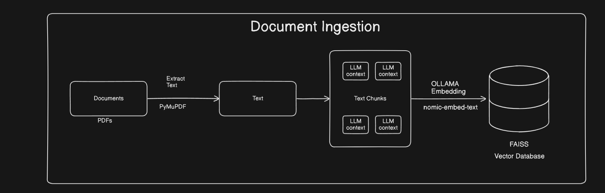
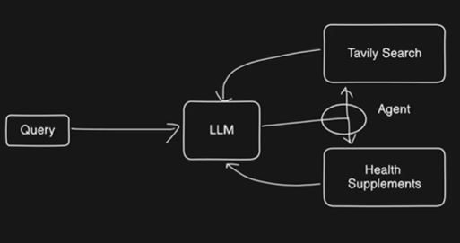
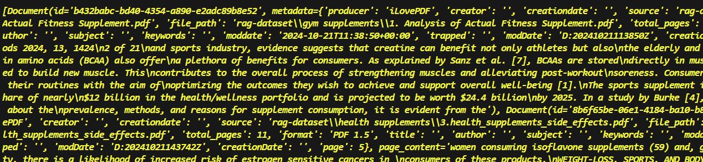
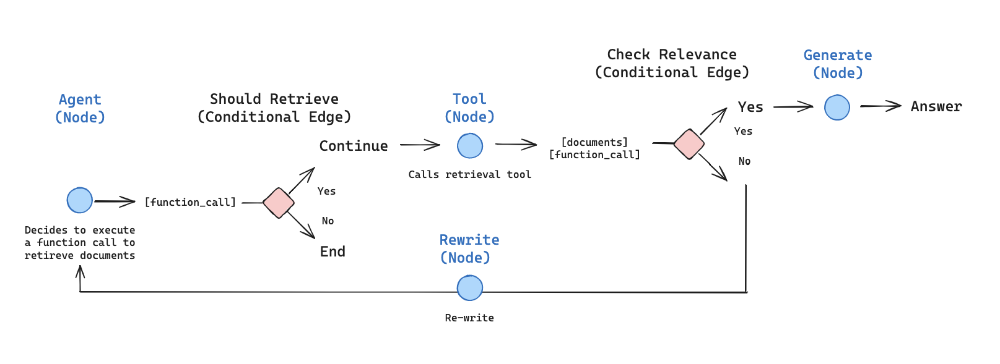
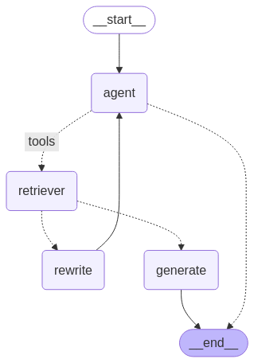

# General: Argentic RAG

## Description

ollama pull nomic-embed-text
## Features

## Requirements

## Installation

## Architecture

## Dependencies
```sh
LangChain
Ollama
LangGraph
SQLAlchemy
Requests
```

# 1️⃣ Vector Stores an Retrieve

## Overview

## Usage
```sh
python 1.Vector_Stores_and_Retrievals.py
```
## Resume

- Carga y extrae texto de PDFs en rag-dataset.
- Divide el texto en fragmentos (chunks) de 1000 caracteres con solapamiento.
- Convierte los fragmentos en vectores mediante embeddings.
- Crea un índice FAISS para almacenar los vectores.
- Agrega los vectores de los fragmentos al índice.
- Realiza una búsqueda semántica basada en una consulta.
- Guarda el índice FAISS localmente.
## Implementation

### Document Loader
**1. Vector Stores and Retrievals**

- 

``` python
loader = PyMuPDFLoader(r"rag-dataset\gym supplements\1. Analysis of Actual Fitness Supplement.pdf")
loader.load()
```

- This dictionary represents a list of `Document` objects, where each object contains two main elements:

- `metadata` (dictionary): Contains information about the document, such as:
    - `producer`: The software used to generate the document (e.g., iLovePDF).
    - `creator`: The creator of the document (empty in this case).
    - `creationdate`, `moddate`, `modDate`: Creation and modification dates.
    - `source`, `file_path`: File path in the system.
    - `total_pages`: Total number of pages in the document.
    - `format`: PDF format.
    - `title`, `author`, `subject`, `keywords`: Bibliographic information.
    - `page`: The specific page number this `Document` represents.

**2. PDFs**
- Buscar PDFs en el directorio "rag-dataset"

``` python
pdfs = []  # Initialize an empty list to store PDF file paths

for root, dirs, files in os.walk("rag-dataset"):  
    # os.walk() iterates through all directories and files inside "rag-dataset"
    # root -> The current folder being scanned  
    # dirs -> List of subdirectories in the current folder  
    # files -> List of files in the current folder  

    # Loop through all files in the current directory  
    for file in files:  
        if file.endswith(".pdf"):  # Check if the file has a ".pdf" extension  
            pdfs.append(os.path.join(root, file))  # Store the full file path  

print("pdf: ", pdfs)  # Print the list of PDF file paths  
```
Ouput:
```sh
pdf:  ['rag-dataset\\finance\\amazon\\amazon-10-q-q3-2024.pdf', 'rag-dataset\\finance\\facebook\\Earnings-Presentation-Q3-2024.pdf', 'rag-dataset\\finance\\facebook\\Meta-09-30-2024-Exhibit-99-1_FINAL.pdf', 'rag-dataset\\finance\\facebook\\META-Q3-2024-Earnings-Call-Transcript.pdf', 'rag-dataset\\finance\\facebook\\META-Q3-2024-Follow-Up-Call-Transcript.pdf', 'rag-dataset\\finance\\google\\goog-10-q-q3-2024.pdf', 'rag-dataset\\gym supplements\\1. Analysis of Actual Fitness Supplement.pdf', 'rag-dataset\\gym supplements\\2. High Prevalence of Supplement Intake.pdf', 'rag-dataset\\health supplements\\1. dietary supplements - for whom.pdf', 'rag-dataset\\health supplements\\2. Nutraceuticals research.pdf', 'rag-dataset\\health supplements\\3.health_supplements_side_effects.pdf']
```
- Cargar cada PDF con PyMuPDFLoader 

``` python
docs = []
for pdf in pdfs:  # Loop through each PDF file path stored in the pdfs list
    loader = PyMuPDFLoader(pdf)  # Create a PDF loader using PyMuPDFLoader
    temp = loader.load()  # Load the content of the PDF (extract text and metadata)
    docs.extend(temp)  # Add the extracted content to the docs list
```   
- `docs` contendrá todos los textos extraídos de los PDFs.

### Document Chunking and embedding

**1. Text splitter structure**
```sh
    "TokenTextSplitter", "TextSplitter", "Tokenizer", "Language", "RecursiveCharacterTextSplitter", "RecursiveJsonSplitter",
    "LatexTextSplitter", "PythonCodeTextSplitter", "KonlpyTextSplitter", "SpacyTextSplitter", "NLTKTextSplitter", 
    "split_text_on_tokens", "SentenceTransformersTokenTextSplitter", "ElementType", "HeaderType", "Line
```
**2. Chunking**

-   RecursiveCharacterTextSplitter:
    - Divide los documentos en fragmentos de 1000 caracteres.
    - Se superponen 100 caracteres entre fragmentos para contexto.
- `chunks` contendrá los fragmentos generados

``` python
text_splitter = RecursiveCharacterTextSplitter(chunk_size=1000, chunk_overlap=100)
chunks = text_splitter.split_documents(docs)
```

- **Ejemplo conceptual**
``` python
chunks[0].page_content = "Protein is essential for muscle growth. A diet rich in lean meats, eggs, and legumes helps build muscle mass."
chunks[1].page_content = "A diet rich in lean meats, eggs, and legumes helps build muscle mass. Strength training also plays a key role."
```

**3. Vectorización de documentos**
- Convierte el texto del primer fragmento (`chunks[0].page_content`) en un vector numérico.
- `vector` representa el contenido semántico del texto en una matriz de números, es la representación matemática de un `chunk` en un espacio de alta dimensión.
    - `vector = [0.234, -0.875, 0.562, 1.134, -0.782, ...] `
``` python
vector = embeddings.embed_query(chunks[0].page_content)
```

**4. Creación de un índice FAISS**
- `faiss.IndexFlatIP(d)`:
    - Crea un índice FAISS basado en el Producto Interno (`IP` = Inner Product).
    - `len(vector)`: Dimensión del vector de embeddings.
- FAISS necesita un espacio vectorial uniforme: Todos los vectores en el índice deben tener la misma cantidad de dimensiones.
- Si las dimensiones no coinciden, FAISS generará un error.

``` python
index = faiss.IndexFlatIP(len(vector))
```

**5. Creación de FAISS Vector Store**
- Se crea un almacén de vectores `FAISS` con:
    - `embedding_function=embeddings`: Función de embeddings para convertir textos en vectores.
    - `index=index`: Índice FAISS donde se almacenarán los vectores.
    - `docstore=InMemoryDocstore()`: Almacén de documentos en memoria.
    - `index_to_docstore_id={}`: Diccionario vacío para mapear IDs de FAISS a documentos.

``` python
vector_store = FAISS(
    embedding_function=embeddings,
    index=index,
    docstore=InMemoryDocstore(),
    index_to_docstore_id={}
)
```
- Agregar documentos al indice FAISS
    - Agrega los fragmentos (`chunks`) al índice FAISS.
    - Genera un ID único para cada fragmento agregado.
    - Devuelve una lista de IDs (`ids`) asignados a cada documento agregado.

``` python
ids = vector_store.add_documents(documents=chunks)
```

**Output**
``` python
ids-> ['doc_1', 'doc_2', 'doc_3', ..., 'doc_N']
```

**6. Busqueda de documentos relevantes**

- Busca los 5 documentos más similares a la pregunta `"how to gain muscle mass?"`.
- `search_type='similarity'`: Usa similitud de coseno o producto interno para recuperar los documentos más cercanos semánticamente.
- FAISS devuelve los IDs de los 5 fragmentos más relevantes.
- Con esos IDs, podemos recuperar el contenido original de los fragmentos.

``` python
question = "how to gain muscle mass?"
result = vector_store.search(query=question, k=5, search_type='similarity')
```

**7. Guarda el indice FAISS**
- Guarda el índice FAISS en una base de datos para uso futuro.

``` python
vector_store.save_local(db_name)
```
# 2️⃣ Retrieval

## Usage
```sh
python 2.Retrieval.py
```
## 🔹 What does `retriever.invoke(query)` do?

The `invoke(query)` method in a **retriever** from LangChain performs a search in a vector database based on semantic similarity.

### Basically, it does the following:
1. **Converts** the `query` into a numeric vector (using the model with which the database was indexed).  
2. **Searches the vector database** for the most similar documents to the query.  
3. **Returns the relevant documents**, usually ordered by similarity.  


# 3️⃣ Agent
## Overview
- 
- **Agent** : [hwchase17/openai-functions-agent](https://smith.langchain.com/hub/hwchase17/openai-functions-agent)

## Usage
```sh
python 3.Agent.py
```
## Implementation:

**1. Prompt Pulling**
- You fetch a predefined prompt from LangChain Hub, which will guide how the agent interacts with tools.
- This line pulls a pre-defined prompt from the LangChain Hub. LangChain Hub is a collection of reusable code and models. In this case, you're pulling a specific prompt or agent from the hub, identified by `hwchase17/openai-functions-agent`. This prompt will guide how the agent interacts with the tools you provide it.

-   `hub.pull()` is a method to fetch or download a model or prompt from the LangChain Hub, which contains predefined setups and tools.

```python
prompt = hub.pull("hwchase17/openai-functions-agent")
pprint(prompt.messages, indent=2, width=80)
```
**Output:**
```sh
[ SystemMessagePromptTemplate(prompt=PromptTemplate(input_variables=[], input_types={}, partial_variables={}, template='You are a helpful assistant'), additional_kwargs={}),
  MessagesPlaceholder(variable_name='chat_history', optional=True),
  HumanMessagePromptTemplate(prompt=PromptTemplate(input_variables=['input'], input_types={}, partial_variables={}, template='{input}'), additional_kwargs={}),
  MessagesPlaceholder(variable_name='agent_scratchpad')]
```
**2. Tools Definition:**
-   You define the tools (search and health_supplements) that the agent can use to gather information.
    - **search**: Likely a tool that allows searching a database or external source.
    - **health_supplements**: Likely a tool specifically designed to handle queries about health supplements.

```python
tools = [search, health_supplements]
```
**3. Agent creation:**
- You create an agent that can call these tools with the help of a language model.
- `create_tool_calling_agent()` is a function that sets up an agent capable of using the defined tools. It essentially enables the agent to call these tools in response to user queries.
- The `llm` represents the language model (for example, GPT-3 or GPT-4), which processes the queries and generates responses.
- The `` defines how the agent should interact with the tools.
```python
agent = create_tool_calling_agent(llm, tools, prompt)
```
**4. Agent execution:**
- The agent's execution process is managed by `AgentExecutor`, which ensures the tools are used to answer the question.
- The `AgentExecutor` coordinates the agent, ensures that the tools are correctly used, and handles the execution flow.
```python
agent_executor = AgentExecutor(agent=agent, tools=tools, verbose=True)
```
**5. Question processing:**
- You define a question about the side effects of too much vitamin D and invoke the agent to get a response.
```python
question = "What is the best supplement for muscle gain?"
#question = "what's weather in New York?"
# = "What are the side effects of taking too much vitamin D?"
response = agent_executor.invoke({'input': question})
```

**Output:**
- `health_supplements` is the tool
-Reformulated the query
```sh
Invoking: `health_supplements` with `{'query': 'muscle gain supplements'}`
```
- These are the document which it has extracted from the database.


- Output from de LLM


# 4️⃣ Argentic RAG

## Overview

This project constructs a processing graph to handle query execution using `langgraph`. It defines a sequence of steps to:
1. Write a query.
2. Execute the query.
3. Generate an answer from the results.

## Usage

```sh
   python 2.ArgenticRAG.py
```
## Resume

- **Agents can:**
  - Query the database multiple times to refine their answer.
  - Recover from errors by detecting failed queries and regenerating them.
  - Answer questions based on both schema structure and database content.
  - They can query the database as many times as needed to answer the user question.
  - They can recover from errors by running a generated query, catching the traceback and regenerating it correctly.
  - They can answer questions based on the databases' schema as well as on the databases' content (like describing a specific table).

- **Flow representation**


## Files

- `langraph_agent.py`: The main script that sets up and executes the AI agent.
- `config.py`: Defines database and prompt configurations.
- `query_utils.py`: Contains helper functions for query handling.

## Implementation


### Retrieve**

- **Load vector**
    - `FAISS.load_local(db_name, embeddings)`:
        - Carga un índice FAISS previamente guardado en la base de datos db_name.
        - Usa `embeddings` para convertir nuevas consultas en vectores y compararlos con los almacenados.
    - allow_dangerous_deserialization=True:
        - Permite cargar FAISS desde un archivo local sin restricciones de seguridad.
```python
    vector_store = FAISS.load_local(db_name, embeddings, allow_dangerous_deserialization=True)
```
- **Retriever**
    - `as_retriever(search_type="similarity")`:
        - Convierte `vector_store` en un sistema de recuperación basado en FAISS.
        - `search_type="similarity"`: Utiliza similitud de coseno o producto interno para encontrar fragmentos relevantes.
    - `search_kwargs = {'k': 5}`:
        - Recupera los 5 fragmentos más similares a la consulta.
```python
    retriever = vector_store.as_retriever(search_type="similarity", search_kwargs = {'k': 5})
```
- **Load question and invoke**
```python
    question = "how to gain muscle mass?"
    retriever.invoke(question)
```
- **Retrieval as a tool**

```python
    retriever_tool = create_retriever_tool(
    retriever,
    "health_supplements",
    "Search and retrun information about the Health Supplements for workout and gym",
    )
    tools = [retriever_tool]
```
### **Agent**
- **Flow** : we can lay out an agentic RAG graph like this
    - The state is a set of messages
    - Each node will update (append to) state
    - Conditional edges decide which node to visit next




**1. Document grader**
 
**2. Agent Node**

**3. Rewrite Node**

**1. Generate Node**

### **Graph**
**1. Introduction**
- Start with an agent, call_model
- Agent make a decision to call a function
- If so, then action to call tool (retriever)
-Then call agent with the tool output added to messages (state) 

- 


