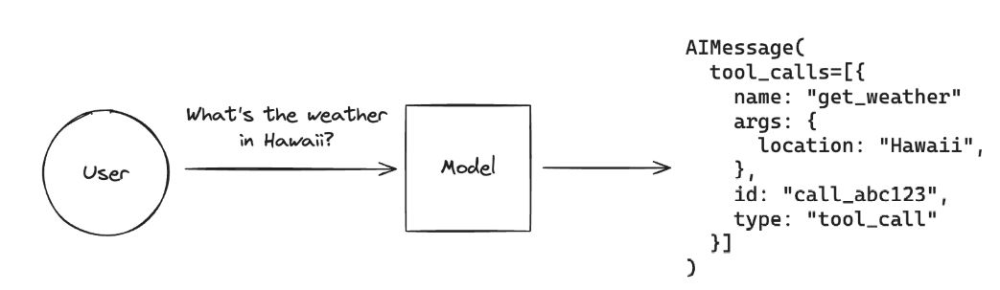

# LangGraph-and-Ollama

https://pytorch.org/get-started/locally/

## 1️⃣ Langchain

This Python code sets up and uses the LangChain Ollama library to interact with a local instance of the LLaMA 3.2 (1B) model for generating responses to user queries. Here's a breakdown of what it does:

### Import necessary libraries:

- dotenv is used to load environment variables from a .env file.
- os is used to access these environment variables.
- ChatOllama from langchain_ollama is used to communicate with the Ollama language model.

### Load environment variables:

- The load_dotenv() function loads variables from a .env file.
- Variables such as LANGCHAIN_API_KEY, LANGCHAIN_ENDPOINT, and LANGSMITH_TRACING are retrieved using os.getenv(), but they are not used in the code.

### Set up the model parameters:

- The local server URL for Ollama is defined as http://localhost:11434.
- The specific LLaMA model used is "llama3.2:1b".
- A link to LangChain's documentation for ChatOllama is included as a comment.

### Initialize the language model (llm):

- The ChatOllama class is instantiated with:
base_url: The URL where the Ollama server is running.
model: The specific LLaMA model version.
temperature: Set to 0.8, meaning responses will have a moderate level of randomness.
num_predict: Limited to 256 tokens for response generation.
Other parameters (not explicitly defined in the code).
 ### Generate a response from the model:

- A Spanish sentence, "¿Cuáles son las causas y consecuencias del cambio climático?", is assigned to sentence.
- The model is invoked with llm.invoke(sentence), generating a response.
- The response content is printed to the console.
### Key Takeaways:
- The script connects to a locally hosted Ollama instance.
- It uses the LLaMA 3.2 (1B) model to process and respond to queries.
- The .env variables are loaded but not actively used in the script.
- The temperature and token limit settings control the model’s response style and length.


## 2️⃣ LanGraph 🦜🕸️

### Information

- https://www.langchain.com/langgraph

- https://github.com/langchain-ai/langgraph

- Tutorial: https://langchain-ai.github.io/langgraph/tutorials/introduction/ 
- Github: https://github.com/langchain-ai/langgraph 
- Network: https://networkx.org/ 
- LanGraph packages: https://github.com/langchain-ai/langgraph/blob/main/libs/langgraph/langgraph/graph/__init__.py 
- Classes : https://github.com/langchain-ai/langgraph/blob/main/libs/langgraph/langgraph/graph/graph.py

### Import Required Libraries
- The script loads environment variables using dotenv, interacts with the operating system via os, and sets up a chatbot using LangChain and Ollama.
- The StateGraph from langgraph is used to manage conversation flow.

### Load Environment Variables
- load_dotenv() loads variables from a .env file, which are typically used for API keys or configurations.
### Initializes the Ollama language model.
- This initializes an Ollama-based chatbot model (llama3.2:3b), which is a local AI model running at http://localhost:11434
### Tests the chatbot with a sample input.
- Sends the message "Hi" to the chatbot and prints the response.
### Defines a State class to hold conversation messages.
- Defines a State class, which holds a list of messages. This state is used to track the conversation.
### Creates a chatbot function that processes user messages.
- This function processes user messages by invoking the language model and returning a response.
### Builds a conversation flow using a StateGraph.
- A StateGraph is created to manage conversation flow.
- The chatbot node is added, and edges define the sequence of interaction (START → chatbot → END).
### Attempts to visualize the graph (which may need fixing).
- This attempts to generate and display a graph visualization of the conversation flow. (This part may cause an error; see my previous fix for this issue.)
### Tests the chatbot with predefined inputs.
- These lines invoke the chatbot with predefined messages to test its responses.
### Implements an interactive chat loop.
- Starts an interactive chat loop.
- The user types a message, the chatbot responds, and this continues until the user types 'q', 'quit', or 'exit'.


## 3️⃣ Tool calling

- LLM Automatically calls the function based on the query
- Function parameters are automatically passed to the function
- It is one of the essential requirements of the Agent
- Not all LLM supports tool calling.



### Custom Tools
### Calling In-Built 
#### DuckDuckGo Search
- https://python.langchain.com/docs/integrations/tools/ 
- DuckDuckGoSearchRun, una herramienta de búsqueda en línea basada en el motor de DuckDuckGo
- search = DuckDuckGoSearchRun()
Crea una instancia de DuckDuckGoSearchRun, que es una clase utilizada en LangChain para ejecutar búsquedas en DuckDuckGo.
Esta clase permite realizar búsquedas en la web sin rastreo, a diferencia de Google.

- search.invoke("What is today's stock market news?")
Ejecuta la búsqueda con la consulta "What is today's stock market news?".
Retorna los resultados de la búsqueda en tiempo real.

#### Tavily Search
#### Wikipedia
#### PubMed
PubMed® comprises more than 35 million citations for biomedical literature from MEDLINE, life science journals, and online books. Citations may include links to full text content from PubMed Central and publisher web sites.
#### Tool Calling with LLM

### Generate Final Result with Tool Calling

```bash 
query = "What is medicine for lung cancer?"
messages = [HumanMessage(query)]
```
messages-> [HumanMessage(content='What is medicine for lung cancer?', additional_kwargs={}, response_metadata={})]
```bash 
ai_msg = llm_with_tools.invoke(messages)
messages.append(ai_msg) # Append AI's response to the messages
print("messages-> ",type(messages))
```

## 4️⃣ Chatbot Langraph

This script sets up a chatbot using LangGraph, LangChain, and Ollama (a local LLM). The chatbot is capable of answering user queries either by using an LLM or by searching the web for real-time information.

Generate api key -> https://app.tavily.com/home 


### Imports:
- TavilySearchResults: A tool for web search.
- ToolNode, tools_condition: Used to create and manage tools in LangGraph.
- HumanMessage, tool: Essential for LangChain's tool-based interactions.
- ChatOllama: A local LLM interface.
### Defining the LLM (ChatOllama):

- llm = ChatOllama(model="llama3.2:3b", base_url="http://localhost:11434")
- This initializes the chatbot using the LLaMA 3.2 model running locally.
### Defining Tools:

- internet_search: Uses TavilySearchResults to fetch real-time web data.
- llm_search: Uses the LLM to generate responses from its trained knowledge.
### Binding Tools to LLM:
- The chatbot is configured to use either the LLM or the internet search tool based on the query.
### State and Memory Management:
- State: Stores messages exchanged in the conversation.
- MemorySaver(): Saves conversation history.
### Building the Graph-Based Chatbot:
- Nodes:
"chatbot": Handles conversation flow.
"tools": Executes the selected tool (either LLM or web search).
- Edges:
The chatbot node decides whether to use a tool.
The tool node processes the query and returns results to the chatbot.
### Visualization:
- graph.get_graph().draw_mermaid_png(): Generates a visual representation of the chatbot's logic.
### Running the Chatbot:
- The chatbot operates in a while True loop.
- The user can input queries, and responses are fetched using the graph-based chatbot.
- The program exits when the user types "exit", "quit", or "q".
### Summary
- This chatbot integrates LangGraph for structured interactions.
- It uses LLaMA 3.2 for AI-generated responses and TavilySearchResults for real-time web search.
- The chatbot decides whether to answer from its own knowledge or search the internet.
- It continuously interacts with users until they choose to exit.


### 4️⃣

### 
###
###
###